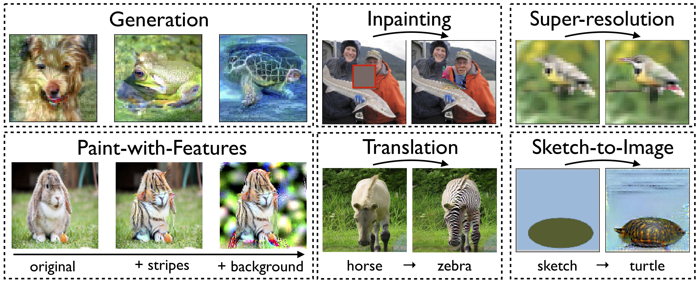

# Code for "Computer Vision with a Single (Robust) Classifier"

These are notebooks for reproducing our paper "Computer Vision with a Single (Robust) Classifier"
([preprint](http://gradsci.org/robust-apps.pdf),
[blog](http://gradsci.org/robust_apps)). 



## Running the notebooks

Steps to run the notebooks (for now, requires CUDA):
- Clone this repository with `--recurse-submodules` to include submodules (`--recursive` pre-Git 2.13)
- Download our models from S3: [CIFAR-10](http://andrewilyas.com/CIFAR.pt), [Restricted ImageNet](http://andrewilyas.com/RestrictedImageNet.pt), [ImageNet](http://andrewilyas.com/ImageNet.pt), [Horse-to-Zebra](http://andrewilyas.com/H2Z.pt), [Summer-to-Winter](http://andrewilyas.com/S2W.pt), [Apple-to-Orange](http://andrewilyas.com/A2O.pt)
- Make a `models` folder in the main repository folder, and save the
  checkpoints there
- Install all the required packages with `pip install -r requirements.txt`
- Edit paths in `user_constants.py` to point to PyTorch-formatted versions of the `CIFAR` and `ImageNet` datasets
- Start a jupyter notebook server: `PYTHONPATH=robustness_lib/ jupyter notebook . --ip 0.0.0.0`

## Citation

```
@inproceedings{santurkar2019computer,
    title={Computer Vision with a Single (Robust) Classifier},
    author={Shibani Santurkar and Dimitris Tsipras and Brandon Tran and Andrew Ilyas and Logan Engstrom and Aleksander Madry},
    booktitle={Preprint},
    year={2019}
}
```
